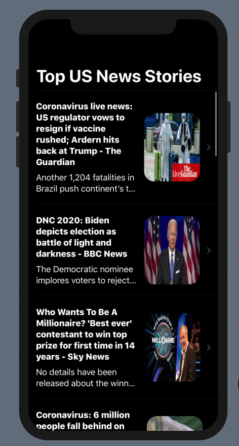
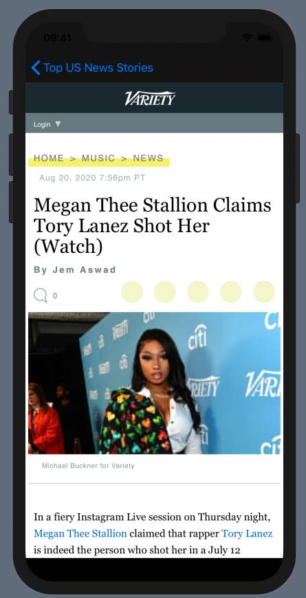
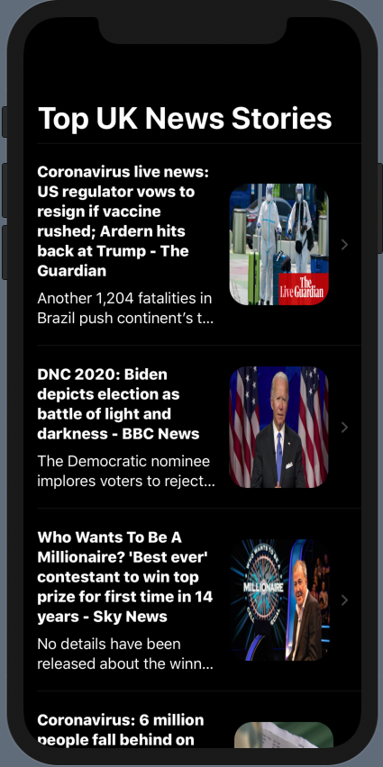
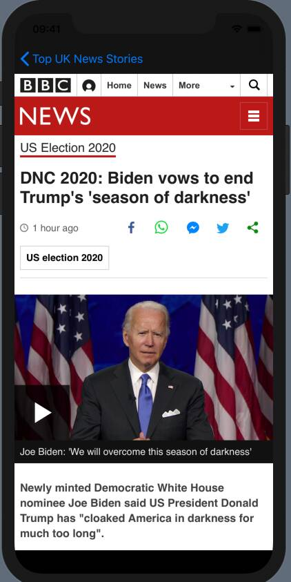

# TEKNews, A SwiftUI News Application Built 100% with Xcode

This Native iOS application derives data from the NewsApi -- [https://newsapi.org] and outputs that data in the form of a VStack Table View List. 

## Demo(s)

<b>United States Top Headlines + Local Web Client</b>

  
   

<b>United Kingdom Top Headlines + Local Web Client</b>

  
   

## Conclusion

**The project was mainly done for learning purposes, but it did help increase my skills in SwiftUI, and parsing/reading .JSON**

***And while I dont think SwiftUI is quite ready to be used for full fledged mobile applications, it for sure IS the future.***

